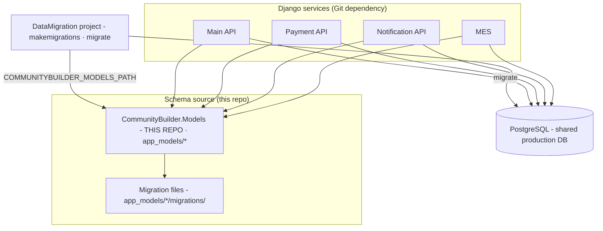

# CommunityBuilder.Models (Rockae shared schema)

**GitHub:** [CommunityBuilder.Models](https://github.com/MyRockae/CommunityBuilder.Models) — **not** a production HTTP service. This repo is the **single source of truth** for Django models and migration **files** under `app_models/`.

## Architecture



**GitHub** repository links are in the tables below.

### Workflow

| Step | Where | Command / action |
|------|--------|------------------|
| **Edit models** | This repo (`app_models/*/models.py`) | Change fields, relations, `Meta` |
| **Generate migrations** | [CommunityBuilder.DataMigrations](https://github.com/MyRockae/CommunityBuilder.DataMigrations) | `python manage.py makemigrations` — writes into **this** repo’s `migrations/` folders |
| **Apply migrations** | DataMigration project | `python manage.py migrate` against target `DATABASE_URL` |
| **Ship to services** | API, Payment, Notification, MES, … | Bump Git pin in each `requirements.txt` after merge |

**Do not** run `migrate` from service repos for schema changes — use **DataMigration** so all environments share the same migration history.

### Consumers (install via `requirements.txt`)

| Service | GitHub | Typical pin |
|---------|--------|-------------|
| **Main API** | [CommunityBuilder.API](https://github.com/MyRockae/CommunityBuilder.API) | `git+https://github.com/MyRockae/CommunityBuilder.Models.git@<commit>` |
| **Payment API** | [CommunityBuilder.PaymentService](https://github.com/MyRockae/CommunityBuilder.PaymentService) | Same pattern |
| **Notification API** | [CommunityBuilder.NotificationService](https://github.com/MyRockae/CommunityBuilder.NotificationService) | Same pattern |
| **MES** | [CommunityBuilder.MES](https://github.com/MyRockae/CommunityBuilder.MES) | Same pattern |

Imports: `from app_models.<app>.models import …`

| | |
|--|--|
| **Python** | 3.8+ |
| **Dependencies** | Django ≥ 4.1, djangorestframework |
| **Local clone** | `C:\GIT\Rockae\CommunityBuilder.Models` |
| **Cursor rules** | `.cursor/rules/rockae-models-context.mdc`, `workspace-repositories.mdc`, `data-migration-workflow.mdc` |

---

## Overview

- **Python:** 3.8+
- **Dependencies:** Django ≥ 4.0, djangorestframework  
- **Package layout:** All models live under the `app_models` package. Each app is a subpackage (e.g. `app_models.community`, `app_models.account`).

## Apps and domains

| App | Description |
|-----|-------------|
| `account` | User, UserRole (custom auth; email as username) |
| `user_profile` | UserProfile (name, bio, interests, avatar, etc.) |
| `shared` | Tag, custom API exceptions |
| `community` | Community, CommunityMember, CommunityLike, CommunityView, CommunityGroup, **CommunityGroupPrice**, CommunityGroupAccess, CommunityBadgeDefinition, CommunityMemberBadge |
| `community_classroom` | Classroom (courses; payment plans, is_published, certificates) |
| `community_classroom_content` | ClassroomContent, ClassroomAttachment, ClassroomContentCompletion, ClassroomCertificate |
| `community_forum` | Forum, Post, PostAttachment, PostLike |
| `community_blog` | CommunityBlogPost, CommunityBlogPostReply |
| `blog` | BlogPost (platform-wide) |
| `community_resource` | Resource, ResourceContent (file folders + files) |
| `community_quiz` | Quiz, QuizGenerationJob, QuizSubmission |
| `community_polls` | Poll, PollOption, PollVote |
| `community_meetings` | Meeting, MeetingSeries (recurring template) |
| `community_chat` | Conversation, ConversationParticipant, Message |
| `community_wheel` | Wheel, WheelParticipant, WheelHandoff, WheelHandoffAttachment (e.g. ajo/savings circles) |
| `community_publicfeeds` | PublicFeed, PublicFeedsAttachment, PublicFeedsLike |
| `community_feedback` | CommunityFeedback (ratings + message per community) |
| `community_leave_reason` | CommunityLeaveReason |
| `community_abuse_report` | CommunityAbuseReport (user reports/flagging of communities) |
| `community_telegram` | CommunityTelegram (per-community Telegram bot token, chat id, enabled flag) |
| `badges` | BadgeDefinition, UserBadge (app-level badges) |
| `app_payments` | `PaymentGateway`, `PaymentTransaction`, `CreatorPayoutAccount` |
| `app_subscription` | `AppSubscriptionTier`, `AppSubscriptionTierPrice`, `AppSubscription`, `CommunityMemberSubscription` |
| `storage_usage` | `StorageUsage` (per-owner file bytes for tier limits) |
| `learning_journey` | Learning journey nodes and member progress |
| `member_engagement` | Member engagement / Pulse telemetry rows |
| `metrics` | Platform metrics aggregates |
| `community_store` | Digital products and purchases |
| `community_event` | Community events and registrations |

## Installation

Install the package (e.g. from Git), then add every `app_models.*` app you use to your project’s `INSTALLED_APPS`. See [INSTALL.md](INSTALL.md) for Git install and usage examples.

**Order:** declare **`app_models.app_payments` before `app_models.app_subscription`** (subscription models import `PaymentGateway` from `app_payments`). Include **`app_models.storage_usage`** if you use `StorageUsage`.

**Imports (after the split):** `PaymentTransaction`, `CreatorPayoutAccount`, and `PaymentGateway` → `app_models.app_payments.models`. `StorageUsage` → `app_models.storage_usage.models`.

## Usage

After installation, import models from the `app_models` namespace:

```python
from app_models.account.models import User
from app_models.community.models import Community, CommunityMember
from app_models.community_classroom.models import Classroom
# etc.
```

Run **`migrate`** from [CommunityBuilder.DataMigrations](https://github.com/MyRockae/CommunityBuilder.DataMigrations), not from consumer service repos. See **`data-migration-workflow.mdc`**.

## Related repositories

Monorepo paths: [`.cursor/rules/workspace-repositories.mdc`](.cursor/rules/workspace-repositories.mdc). Package conventions: [`.cursor/rules/rockae-models-context.mdc`](.cursor/rules/rockae-models-context.mdc).

### CommunityGroup rename (`community.0011`)

Apply migrations with a **full** `python manage.py migrate`, not `migrate community` alone. If `community.0011` is recorded while follow-up migrations are not, Django can fail on startup with *lazy reference to `community.paymentplan`* because `PaymentPlan` no longer exists in migration state.


**Recovery (PostgreSQL):** if the DB already matches the renamed schema (tables/columns from `0011` and the M2M state-only migrations) but `django_migrations` is missing rows, insert the missing names so state matches reality, then run `migrate` again:

```sql
INSERT INTO django_migrations (app, name, applied)
SELECT v.app, v.name, NOW() FROM (VALUES
  ('community_polls', '0002_alter_poll_payment_plans'),
  ('community_quiz', '0002_alter_quiz_payment_plans'),
  ('community_resource', '0006_alter_resource_payment_plans'),
  ('community_forum', '0003_alter_forum_payment_plans'),
  ('community_classroom', '0003_alter_classroom_payment_plans'),
  ('community_meetings', '0003_alter_meeting_payment_plans'),
  ('app_subscription', '0003_rename_community_group_fields')
) AS v(app, name)
WHERE NOT EXISTS (
  SELECT 1 FROM django_migrations d WHERE d.app = v.app AND d.name = v.name
);
```

Skip any row for an app/migration you have not actually applied yet (schema mismatch). If the database was **not** fully migrated through `0011`, roll back with a restore or reverse the schema manually instead of inserting rows.

### Community group per-currency pricing (`community.0014`–`community.0017`)

`CommunityGroupPrice` links a `CommunityGroup` to an ISO currency + amount (same pattern as `AppSubscriptionTierPrice`). Migration **0014** seeds one **USD** row from the legacy `fee` column for each group that was not marked free (upgrade path). Migration **0015** removes the `fee` column. Migration **0016** removes `CommunityGroup.is_free`; a tier is **free** when it has no `CommunityGroupPrice` row with `amount > 0`. Migration **0017** replaces `is_recurring` with **`is_monthly`**, **`is_yearly`**, and **`is_lifetime`** (at most one True; free tiers leave all False). Payment APIs resolve amount/currency from billing country + gateway like app subscriptions.
